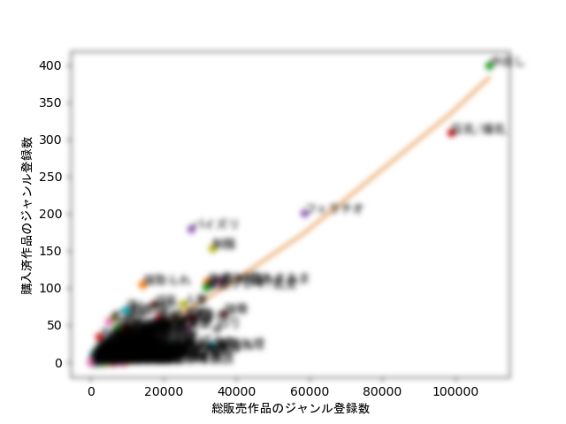
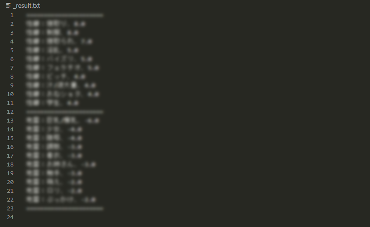

# dlsite_analytics

DLsiteの __"男性向け"__ 購入履歴作品のジャンルから性癖／地雷を一次回帰で見つけるやつ

こんな感じで結果が出ます



またグラフから、近似線とポイントの距離で点数を算出してます



## 前提条件

- Dockerをインストール済（実行環境として必要）
- 女性向け・海外向けには対応してません、一般向けでも正常に結果が出ない可能性があります

## 使い方

1. リポジトリをクローンする `git clone https://github.com/kyoune01/dlsite_analytics.git`
1. [.devcontainer/docker run](https://docs.docker.com/) か [up vscode-remote](https://code.visualstudio.com/docs/remote/containers-tutorial) でコンテナを起動、コンテナ内へ移動する
1. 環境変数ファイルを作成、ファイルへdlsiteのログイン情報を記載する `cp .env.default .env`
1. 解析スクリプトを実行する `python main.py`
1. 正常に終了した場合、下記4ファイルが自動生成されます
    - 回帰グラフ画像
    - 購入作品JSON
    - ジャンルのカウントJSON
    - 性癖／地雷のTOP10

## warning

本リポジトリは個人の嗜好を解析することだけが目的のリポジトリです。もしツールを利用することでDLsiteに不利益を与えることが判明した場合、即座に利用を中止してください。本リポジトリもすぐに削除します。

This repository is for the sole purpose of analyzing personal preferences. If your use of the tool is found to be detrimental to DLsite, please stop using it immediately. I'll delete this repository as soon as I can.

## 開発メモ

### パッケージ追加方法

pipでインストールする。必ずrequirements.txtを更新すること（イメージへ反映するため）

```
pip install <package_name>
pip freeze > requirements.txt
```